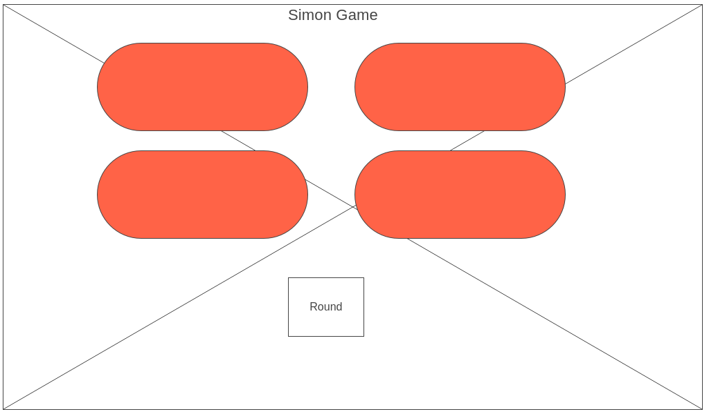
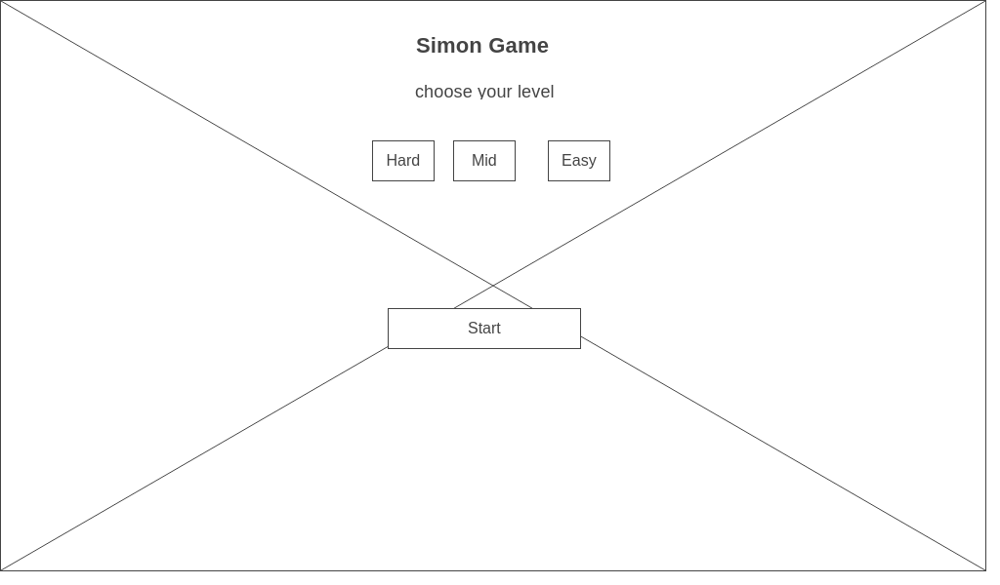
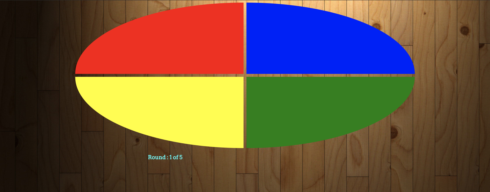

# Simon Game

you have to press the colors in the same order the computer will show you

Simon Game website
https://sbinhimd.github.io/simon/

## Description

Simon is a memory game where you have to remember the buttons presses and press it again in the same order,in each round the cpu will show you the previous presses and plus the new ones, can you ?
- on easy the cpu will add one color each round
- on mid the cpu will add two colors each round
- on hard the cpu will add three colors each round

### Technical Used


```
HTML (just for the script and css link)
CSS
JavaScript (all the code created with DOM)
```

### Wireframes







### User Stories

A story of the project user, that explains the use of the project.

- as a user i want to select the difficulty level of the game
- as a user i want to know in which round i'm playing


---

## Planning and Development Process

A basic story of your planning and developing this project.
### Day 1
- worked on the basic css
- begin with the logic

### Day 2
- completed the basic interface
- half of the game logic is done
- added audio files

### Day 3
- added levels to the game (needs a fix)
- added simple levels interface

### Day 4
- enhance the game interface
- completed the game logic 
- fixed the levels problem
- added @media on css so the game can work on small screens


### Problem-Solving Strategy

- console logs
- following the code step by step

### Unsolved problems

- tones plays if the user win
- disable buttons while cpu shows the buttons

---

## Acknowledgments

* thanks to the instructing team for the amazing experience so far

---

 ## References
 - sweet alert 2
 - google fonts
