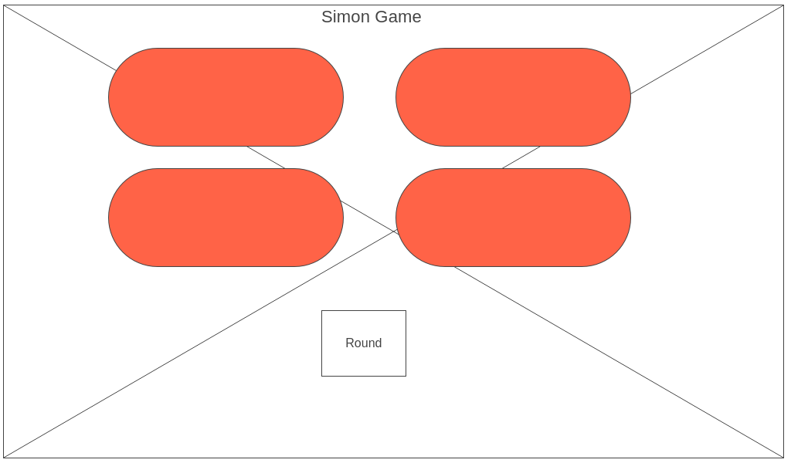
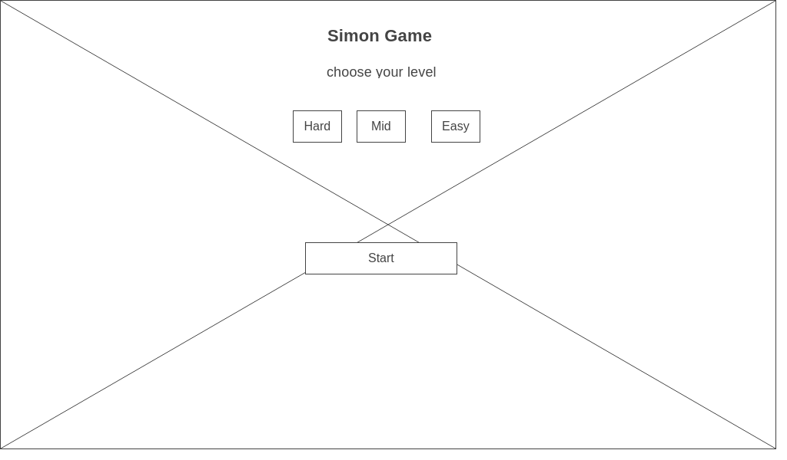

# Simon Game

you have to press the buttons in the same order the computer will show you

## Description

Simon is a memory game where you have to remember the buttons presses and press it again in the same order, can you ?

### Technical Used


```
HTML (just for the script and css link)
CSS
JavaScript (all the code created with DOM)
```

### Wireframes





### User Stories

A story of the project user, that explains the use of the project.

- as a user i want to select the difficulty level of the game
- as a user i want to know in which round i'm playing


---

## Planning and Development Process

A basic story of your planning and developing this project.
### Day 1
- worked on the basic css
- begin with the logic

### Day 2
- completed the basic interface
- half of the game logic is done
- added audio files

### Day 3
- added levels to the game (needs a fix)
- added simple levels interface

### Day 4
- enhance the game interface
- completed the game logic 
- fixed the levels problem


### Problem-Solving Strategy

- console logs
- following the code step by step

### Unsolved problems

- tones plays if the user win

---

## Acknowledgments

* thanks to the instructing team for the amazing experience so far

---

 ## References
 - sweet alert 2
 - google fonts
